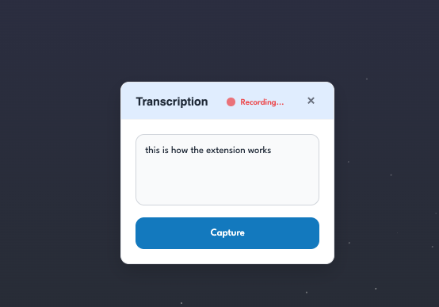
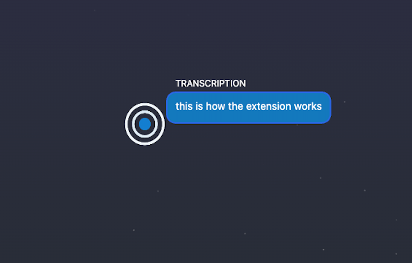

# SnapInsights - UX Research Screenshot Extension

A Chrome browser extension designed for UX researchers to capture screenshots with contextual annotations and voice-recorded insights.


## Features

- Quick screenshot capture with Alt+Click
- Text and voice annotations
- Automatic file organization
- Metadata embedding
- Research workflow optimization

## How It Works

### 1. Choose Your Mode
Select from Snap, Annotate, or Transcribe mode in the extension popup based on your research needs.


### 2. Capture Insights
Use **Alt + Click** to capture screenshots, add annotations, or record voice memos at specific locations.



### 3. Automatic Save
Screenshots are automatically saved to your Downloads folder with embedded metadata and structured naming.



## Development

### Prerequisites

- Node.js 16+
- Chrome browser

### Setup

```bash
npm install
```

### Build

```bash
# Development build with watch
npm run dev

# Production build
npm run build
```

### Testing

```bash
# Run tests
npm test

# Run tests in watch mode
npm run test:watch
```

### Loading Extension

1. Build the extension: `npm run build`
2. Open Chrome and go to `chrome://extensions/`
3. Enable "Developer mode"
4. Click "Load unpacked" and select the `dist` folder

## Project Structure

```
src/
├── background/     # Background service worker
├── content/        # Content scripts
├── popup/          # Extension popup UI
├── components/     # React components
├── utils/          # Utility functions
└── manifest.json   # Extension manifest
```
